### O que é git?

É um sistema de controle de versão distribuido (DVCS)  
É gratuito e de codigo aberto  
Foi projetado para lidar desde pequenos projetos a projetos muito grandes  
É otimizado para operaçoes locais (projetado para funcionar de maneira eficiente no repositorio local(meu computador) nao tendo assim a necessidade de ficar se conectando o todo mundo ao repositorio remoto)  
branching (ramificações, nao precisa mexer na main pode abrir ramificações para testar coisas isoladas como correção de bugs)  
Snapshots, não deltas (como você consegue controlar o estado do arquivo)

### o que é controle de versão?

o controle de versao é um sistema que registra alteraçoes em um arquivo ou conjunto de arquivos ao longo do tempo para que você posssa recuperar versoes especificas posteriormente


### Controle de versão centralizado

um unico servidor onde todas as versões do codigo ficam guardadas, o desenvolvedor precisa ir ate esse servidor para acessar o codigo, existe apenas um lugar onde o versionamento esta guardado

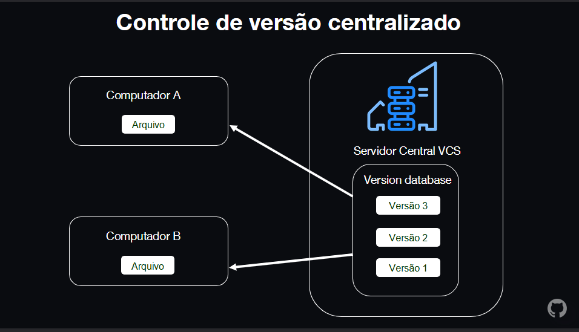

### Controle de versão distribuido

nesse modelo cade dev tem uma copia completa do codigo e um historico das mudanças no seu proprio local (computador). Cada um tem um servidor completo no seu computador e quando quiser enviar as mudanças pro repositorio central também consegue fazer isso do seu computador, pode trabalhar offline também consegue. 

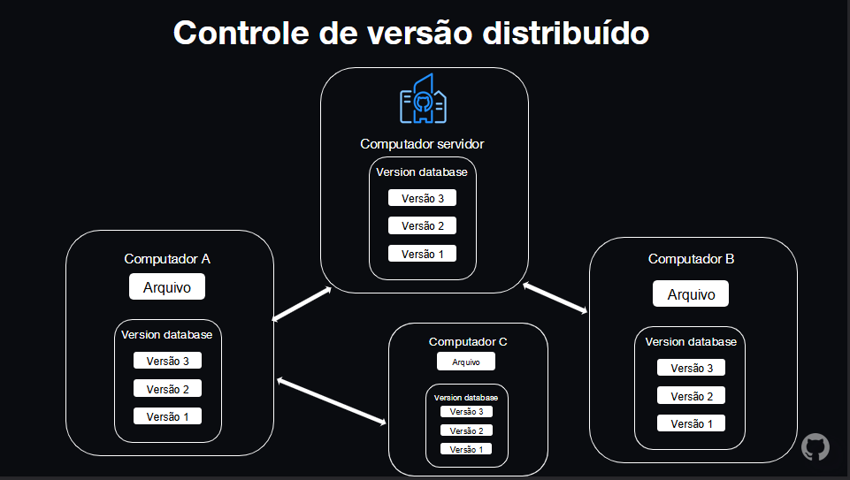

### quais as vantagens do git?

snv -> exemplo de um sistema de versao que nao é o git
o git é mais eficiente que os concorrentes
o github é um diferencial
é muito rapido com relação a protocolos


### snapshots (instantaneos) vs deltas

**snapshots** é como tirar uma foto do sistema ou do conjunto de dados, capturar tudo como esta em um momento especifico

vantagem: capturar o estado completo do sistema/dados/pagina e a facilidade de conseguir recuperar isso e restaurar

é essa abordagem que o git utiliza

**deltas**

apenas registra a mudança feita desde o ultimo snapshot/delta  
anota apenas a diferença desde a ultima vez que você modificou algo  
só resgistra a mudança da alteração

vantagem: armazena menos informações porem se ouvir muitas mudanças fica dificil (complexo) de recurar um estado especifico de maneira completa.


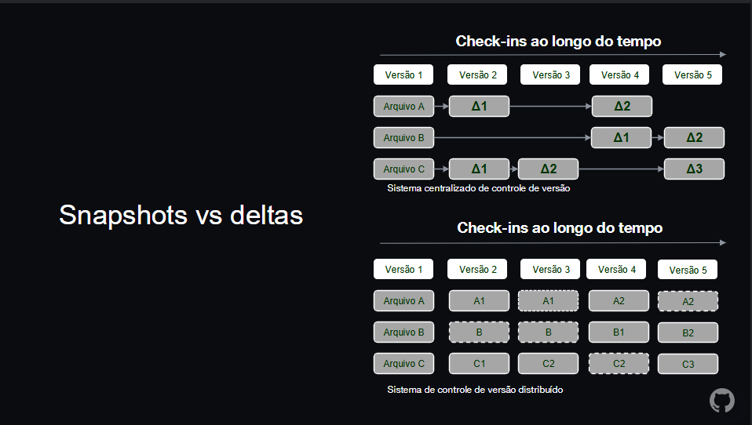

### como o git interage com o GitHub


GitHub é um sistema de controle de versão (VCS)

- rastreia as mudanças
- backup de historico "snapshots"
- time developer
- flexivel local/DevOps tools

### Terminologia

- Working tree - lugar onde interagimos com o projeto (diretorio de arquivos)
- Stagging Area - local onde coloca os arquivos que você considera prontos para serem rastreados pelo git
- repository - local final onde você organiza seus arquivos existem os repositorios locais (seu computador) e repositorios remotos que sao armazenados remotamente e é acessivel a todos os membros do projeto.  
- hash - mudança categorizada, codigo (identificador) unico para cada alteração (commit), é um hexadecimal, a impressao digital de cada alteração.
- object -é uma das unidades fundamentais de armazenamento de dados no repositório. Todos os arquivos, pastas, commits e até mesmo referências são representados internamente como objetos. eles podem ser do tipo: 
    - blob: armazena conteudo de arquivos (nao o nome ou caminho apenas o conteudo) e cada vez que um arquivo é adicionado ao repositorio seu conteudo é convertido em blob
    - tree: representa um diretorio, contem referencias e blobs e a outros tree (subdiretorios, guarda também os nomes dos arquivos/diretorios e permissoes)
    - commit: armazena uma referencia para a tree, o autor, a mensagem do commit e possivelmente commit pais (no caso de historio linear ou merges). representa um snapshot(foto) do repositorio naquele momento
    - tag: um marcador para cada commit especifico, comumente usado para marcar versoes (como v1.0, v2.1)

Os objetos sao a base de funcionamento do git garantindo integridade rastreabilidade e eficiencia, esles sao armazenados em .git/objects

- commit - registro da mudança do arquivo, com data hora e comentario sobre. 
- branch - 
- remote
- comandos, subcomandos, e opçoes

### comando básicos do git

```bash
$git config
$git init
$git clone <path>
$git add <file_name>
$git commit
$git status
$git remote
$git checkout <branch_name>
$git branch
$git push
$git pull
$git merge <branch_name>
$git diff
$git reset
$git revert
$git tag
$git log
```

### Git VS GitHub

**Git** é um sistema de controle de versao distribuido (DVCS)  
**GitHub** é uma plataforma de hospedagem de codigo-fonte e arquivos com controle de versa usando git

GitHUb também é uma plataforma social para desenvolvedores colaborarem e compartilharem codigo

### github accounts and plans

github oferece uma variedade de tipos de contas, incluindo free (gratuitas) e paid (pagas)

contas pagas (paid accounts) possuem acesso a funcionalidades adicionais, como maior armazenamento e segurança avançada

organizaçoes podem comprar planos que permitem maior colaboraçao e controle de repositorios


### github enterprise server

O github enterprise server é uma versao do github que voce pode hospedar no seu proprio ambiente de rede  
foi projetado para empresas que desejam a funcionalidade do github mas que por razoes de segurança ou regulamentaçao precisam hospeda-los em seus proprios servidores  
é ideal para organizações que precisam de um ambiente de desenvolvimento colaborativo mas que precisam cumprir requisitos rigorosos de segurança e privacidade

### como acessar o github

- entre em https://www.github.com

### github desktop

é um aplicativo de software indepente e de codigo aberto que permite e facilita a colaboraçao entre voce e sua equipe e o compartilhamento das melhores praticas de git e github dentro da sua equipe

com o github desktop voce pode

- adicionar e clonar repositorios
- adicionar alteraçoes ao seu commit de forma interativa
- adicionar rapidamente coautores ao seu commit
- conferir filiais com solicitaçoes pull e vizualizar status de CI
- comparar imagens alteradas

### github mobile

Oferece uma maneira de relaizar trabalhos de alto impacto no github rapidamente e de qualquer lugar  
é um app seguro e confiavel

com o github mobile voce pode

- gerenciar, fazer triagem e limpar notificaçoes do github.com
- ler, revisar e colaborar em problemas de solicitaçoes pull
- editar arquivos em pull requests
- pesquisar, navegar e interagir com ususarios, repositorios e organizaçoes
- receber notificaçao push quando alguem mencionar seu nome de usuario
- agendar notificaçoes push para horarios personalizados especificos
- proteger sua conta github.com com autenticaçao 2 fatores
- verificar suas tentativas de login em dispositivos nao reconhecidos

### github - ecossistema - navegaçao de repositorio

### github marketplace

é uma plataforma onde voce pode descobrir e comprar ferramentas que se integram ao github para ajudar a otimizar o seu fluxo de trabalho

funcionalidades  

- repos
- issues
- discussions
- pull requests
- notifications
- labels
- actions
- forks
- projects

### conta pessoal vs conta da organizaçao

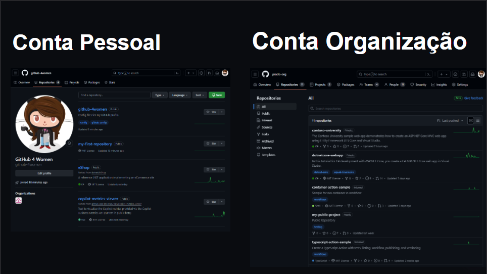

### guias de navegaçao e contribuiçoes

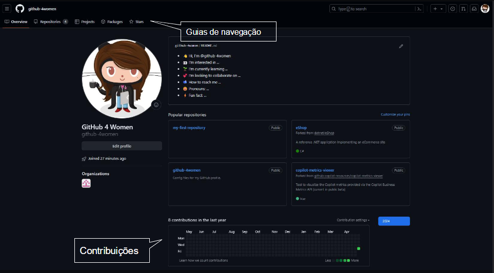
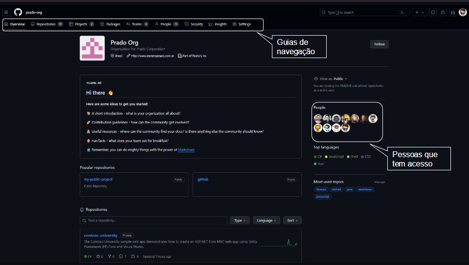
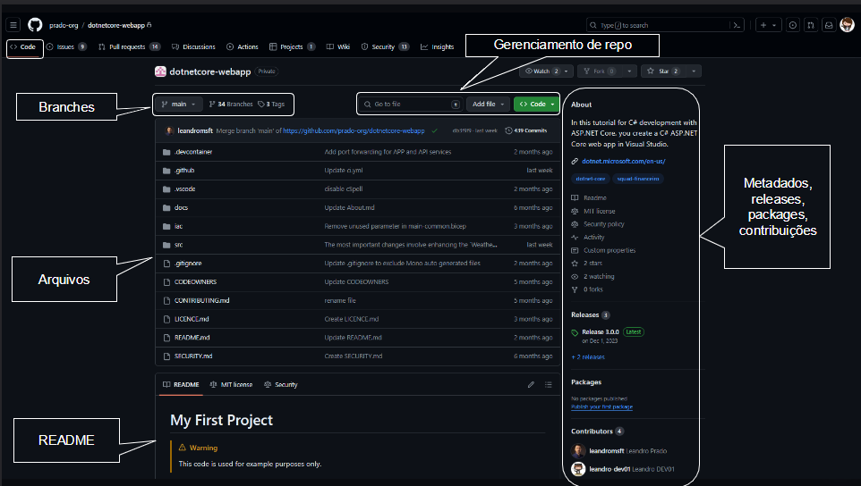
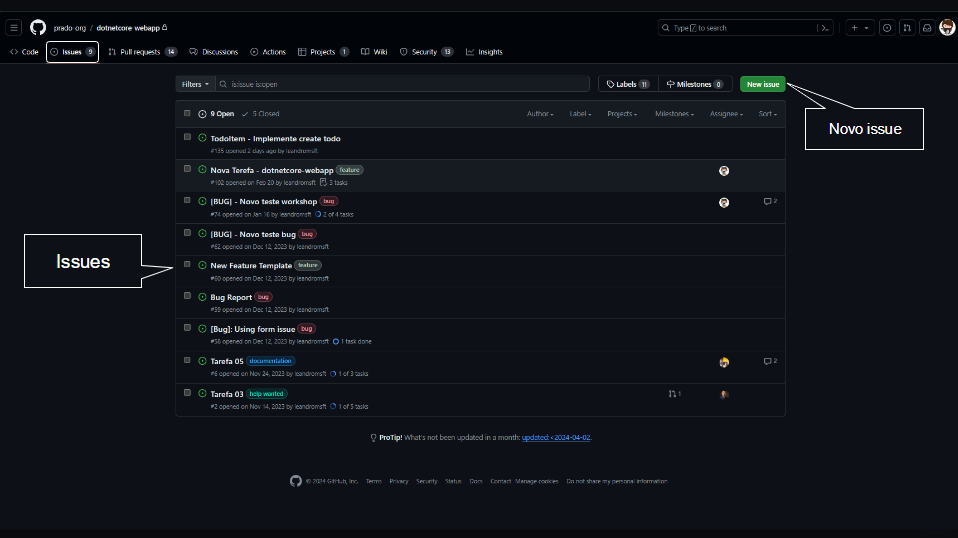
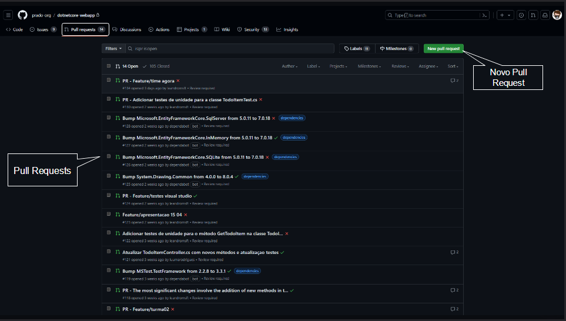
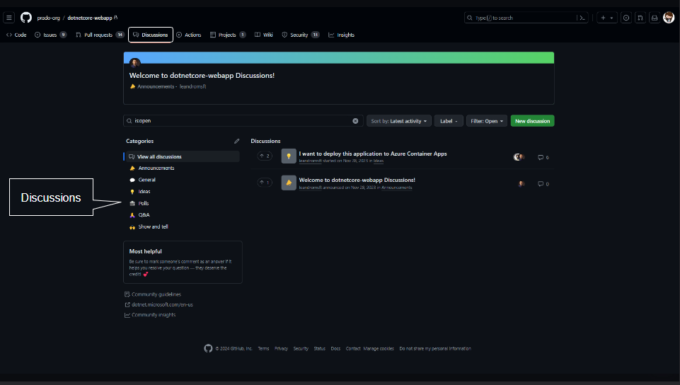
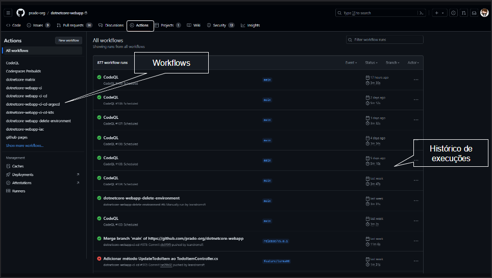
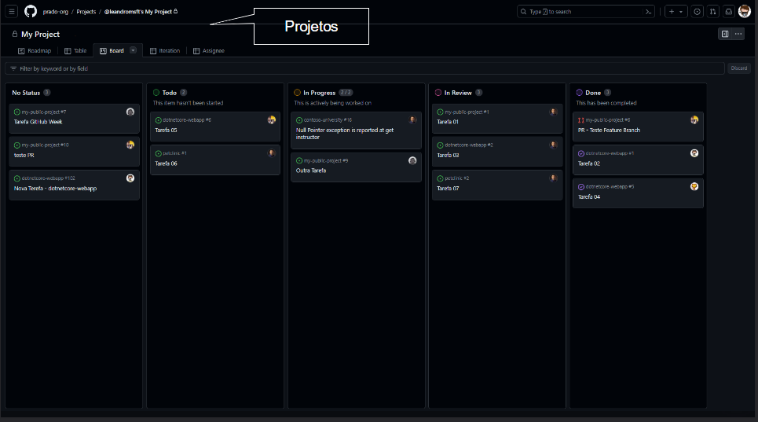
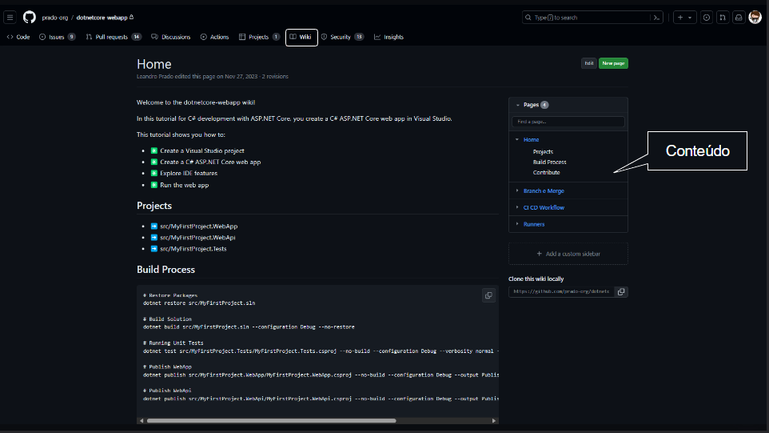
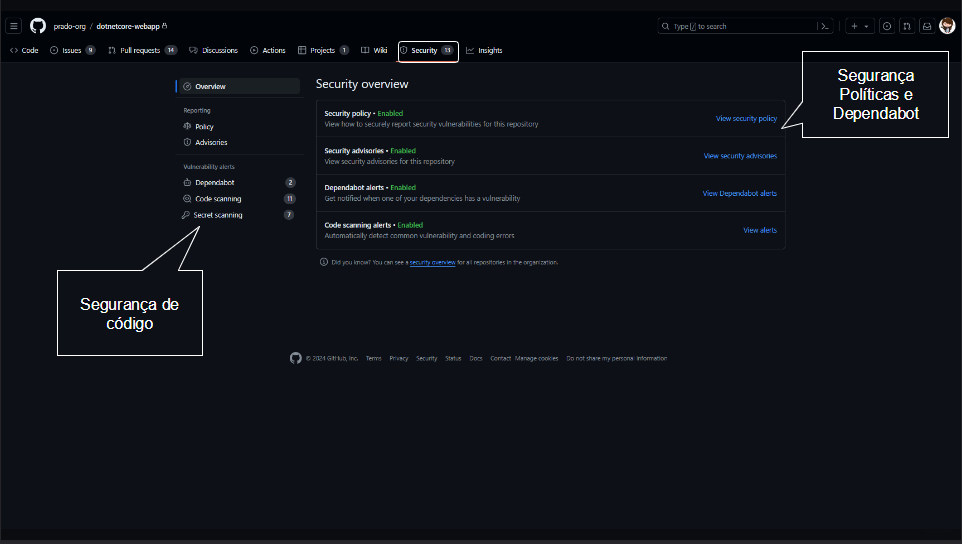
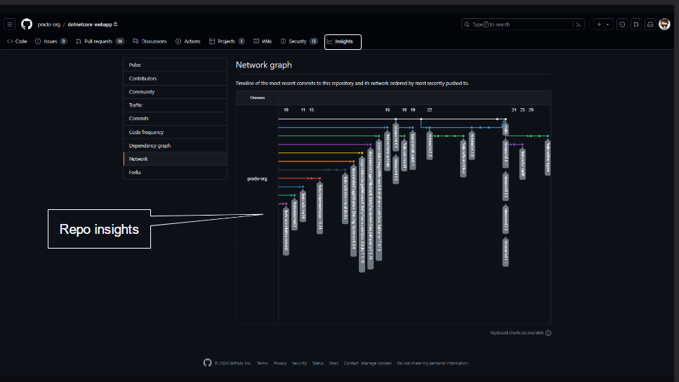
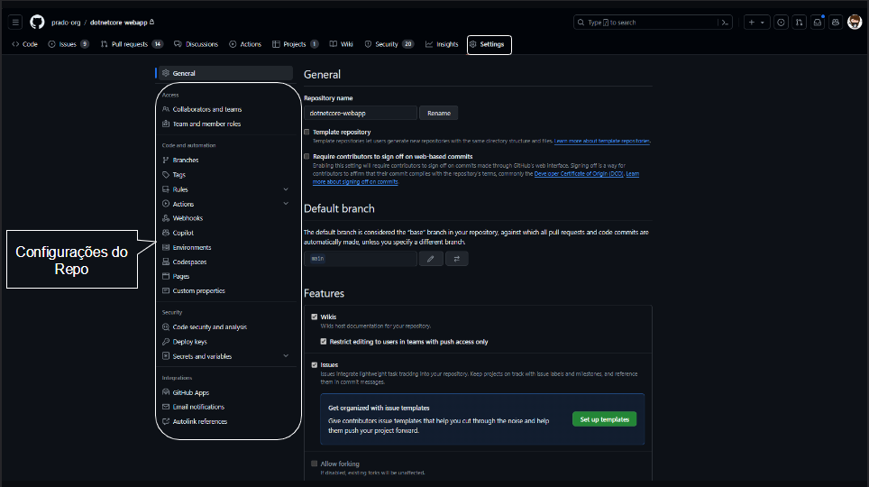

### o que é markdown?

é uma linguagem de marcaçao leve usada para formatar texto simples   
foi projetado para ser facil de ler e escrever ao mesmo tempo que permite que seja convertido facilmente em HTML ou outros formatos de documento

### syntax basica do markdown

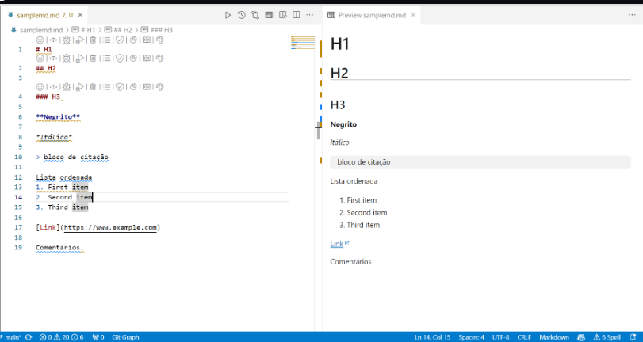

<!-- assim faz um comentario--> 
<!-- # titulo grande ## titulo medio ### titulo pequeno 
 **coloca o texto em negrito** 
 *coloca o texto em italico*
 > faz um bloco de citaçao
 faz uma lista ordenada
 1. item 1
 2. item 2
 3. item 3

 [link](https://www.example.com) insere link externo
 [nome](caminhoparapasta) insere link interno
-->

### pull request/issues

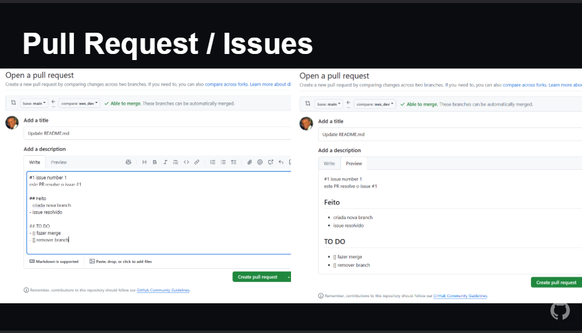

### estrategias de branch/merge

### o que é commit?

é um registro instantaneo do seu repositorio em um momento especifico da linha do tempo 

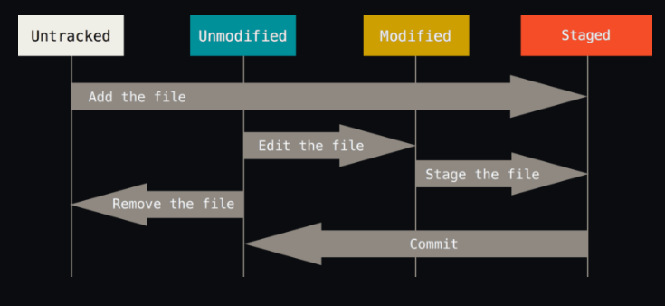

### o que é branch?

é um ponteiro para um commit especifico

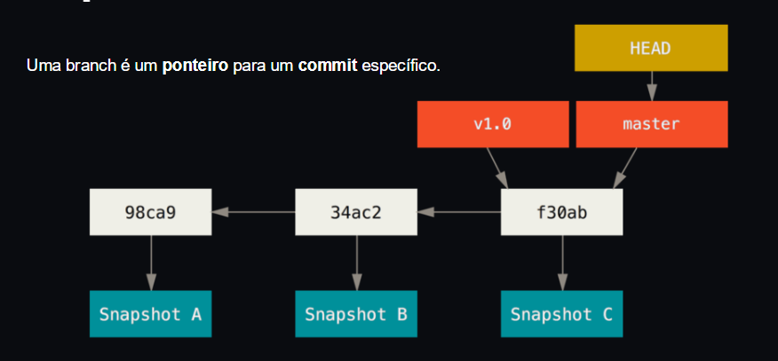

### estrategia de branch

As estrategias de branching determinam como a equipe aborda a ramificaçao do codigo  
no curso sera citado as estrategias **git flow** e **github flow**

### git flow

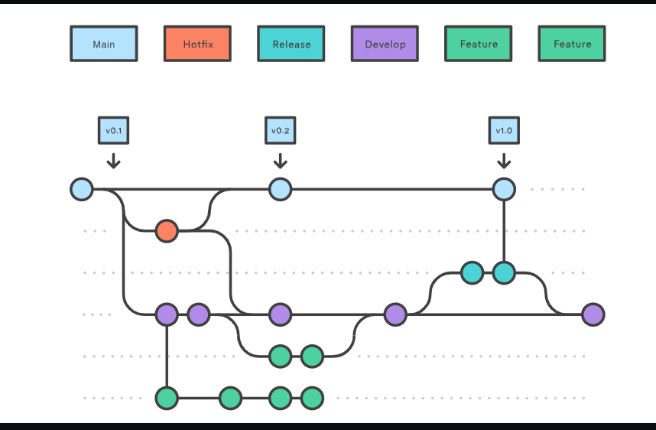

### github flow

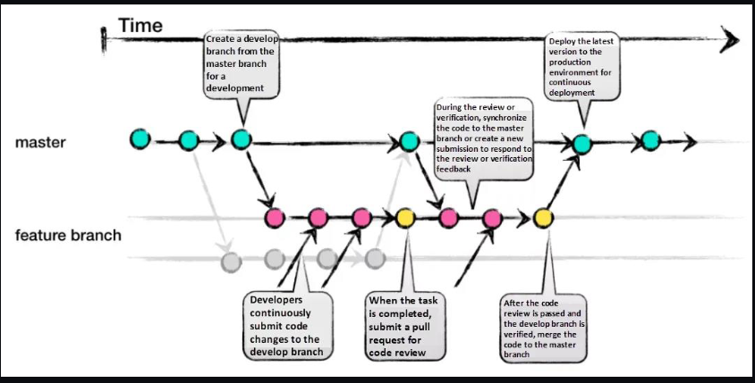