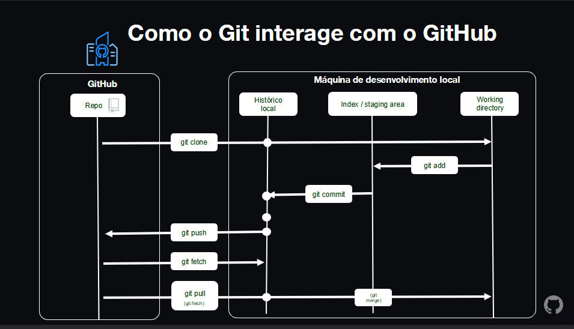

### O que é git?

É um sistema de controle de versão distribuido (DVCS)  
É gratuito e de codigo aberto  
Foi projetado para lidar desde pequenos projetos a projetos muito grandes  
É otimizado para operaçoes locais  
branching ????  
Snapshots, não deltas???

### Controle de versão centralizado


### Controle de versão distribuido


### sanpshots vs deltas


### como o git interage com o GitHub



GitHub é um sistema de controle de versão (VCS)

- siga para mudanças
- backup de historico "snapshots"
- time developer
- flexivel local/DevOps tools

### Terminologia

- Working tree
- repository
- hash
- object
- commit
- branch
- remote
- comandos, subcomandos, e opçoes

### comando básicos do git

```bash
$git config
$git init
$git clone <path>
$git add <file_name>
$git commit
$git status
$git remote
$git checkout <branch_name>
$git branch
$git push
$git pull
$git merge <branch_name>
$git diff
$git reset
$git revert
$git tag
$git log
```

### Git VS GitHub

**Git** é um sistema de controle de versao distribuido (DVCS)  
**GitHub** é uma plataforma de hospedagem de codigo-fonte e arquivos com controle de versa usando git

GitHUb também é uma plataforma social para desenvolvedores colaborarem e compartilharem codigo

### github accounts and plans

github oferece uma variedade de tipos de contas, incluindo free (gratuitas) e paid (pagas)

contas pagas (paid accounts) possuem acesso a funcionalidades adicionais, como maior armazenamento e segurança avançada

organizaçoes podem comprar planos que permitem maior colaboraçao e controle de repositorios


### github enterprise server


