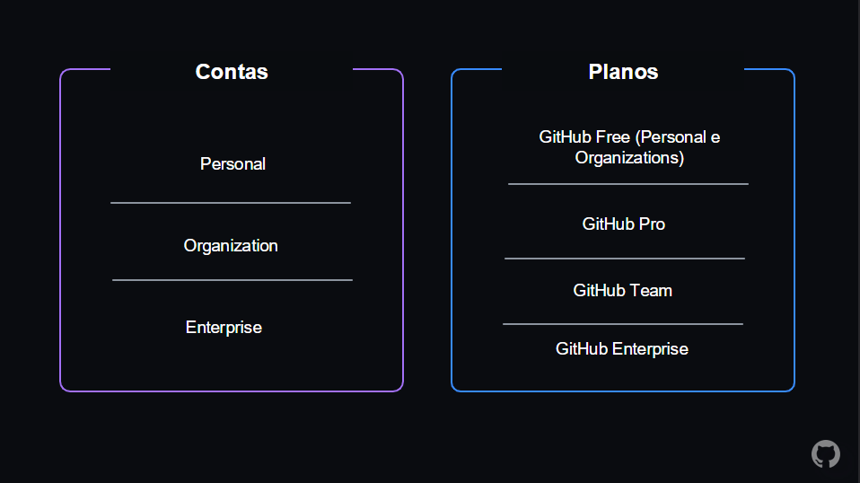

### O que é git?

É um sistema de controle de versão distribuido (DVCS)  
É gratuito e de codigo aberto  
Foi projetado para lidar desde pequenos projetos a projetos muito grandes  
É otimizado para operaçoes locais  
branching ????  
Snapshots, não deltas???

### Controle de versão centralizado


### Controle de versão distribuido


### sanpshots vs deltas


### como o git interage com o GitHub


GitHub é um sistema de controle de versão (VCS)

- siga para mudanças
- backup de historico "snapshots"
- time developer
- flexivel local/DevOps tools

### Terminologia

- Working tree
- repository
- hash
- object
- commit
- branch
- remote
- comandos, subcomandos, e opçoes

### comando básicos do git

```bash
$git config
$git init
$git clone <path>
$git add <file_name>
$git commit
$git status
$git remote
$git checkout <branch_name>
$git branch
$git push
$git pull
$git merge <branch_name>
$git diff
$git reset
$git revert
$git tag
$git log
```

### Git VS GitHub

**Git** é um sistema de controle de versao distribuido (DVCS)  
**GitHub** é uma plataforma de hospedagem de codigo-fonte e arquivos com controle de versa usando git

GitHUb também é uma plataforma social para desenvolvedores colaborarem e compartilharem codigo

### github accounts and plans

github oferece uma variedade de tipos de contas, incluindo free (gratuitas) e paid (pagas)

contas pagas (paid accounts) possuem acesso a funcionalidades adicionais, como maior armazenamento e segurança avançada

organizaçoes podem comprar planos que permitem maior colaboraçao e controle de repositorios



### github enterprise server

O github enterprise server é uma versao do github que voce pode hospedar no seu proprio ambiente de rede  
foi projetado para empresas que desejam a funcionalidade do github mas que por razoes de segurança ou regulamentaçao precisam hospeda-los em seus proprios servidores  
é ideal para organizações que precisam de um ambiente de desenvolvimento colaborativo mas que precisam cumprir requisitos rigorosos de segurança e privacidade

### como acessar o github

- entre em https://www.github.com

### github desktop

é um aplicativo de software indepente e de codigo aberto que permite e facilita a colaboraçao entre voce e sua equipe e o compartilhamento das melhores praticas de git e github dentro da sua equipe

com o github desktop voce pode

- adicionar e clonar repositorios
- adicionar alteraçoes ao seu commit de forma interativa
- adicionar rapidamente coautores ao seu commit
- conferir filiais com solicitaçoes pull e vizualizar status de CI
- comparar imagens alteradas

### github mobile

Oferece uma maneira de relaizar trabalhos de alto impacto no github rapidamente e de qualquer lugar  
é um app seguro e confiavel

com o github mobile voce pode

- gerenciar, fazer triagem e limpar notificaçoes do github.com
- ler, revisar e colaborar em problemas de solicitaçoes pull
- editar arquivos em pull requests
- pesquisar, navegar e interagir com ususarios, repositorios e organizaçoes
- receber notificaçao push quando alguem mencionar seu nome de usuario
- agendar notificaçoes push para horarios personalizados especificos
- proteger sua conta github.com com autenticaçao 2 fatores
- verificar suas tentativas de login em dispositivos nao reconhecidos

### github - ecossistema - navegaçao de repositorio

### github marketplace

é uma plataforma onde voce pode descobrir e comprar ferramentas que se integram ao github para ajudar a otimizar o seu fluxo de trabalho

funcionalidades  

- repos
- issues
- discussions
- pull requests
- notifications
- labels
- actions
- forks
- projects

### conta pessoal vs conta da organizaçao


### guias de navegaçao e contribuiçoes


### o que é markdown?

é uma linguagem de marcaçao leve usada para formatar texto simples   
foi projetado para ser facil de ler e escrever ao mesmo tempo que permite que seja convertido facilmente em HTML ou outros formatos de documento

### syntax basica do markdown


<!-- assim faz um comentario--> 
<!-- # titulo grande ## titulo medio ### titulo pequeno 
 **coloca o texto em negrito** 
 *coloca o texto em italico*
 > faz um bloco de citaçao
 faz uma lista ordenada
 1. item 1
 2. item 2
 3. item 3

 [link](https://www.example.com) insere link externo
 [nome](caminhoparapasta) insere link interno
-->

### pull request/issues


### estrategias de branch/merge

### o que é commit?

é um registro instantaneo do seu repositorio em um momento especifico da linha do tempo 


### o que é branch?

é um ponteiro para um commit especifico


### estrategia de branch

As estrategias de branching determinam como a equipe aborda a ramificaçao do codigo  
no curso sera citado as estrategias **git flow** e **github flow**

### git flow


### github flow

